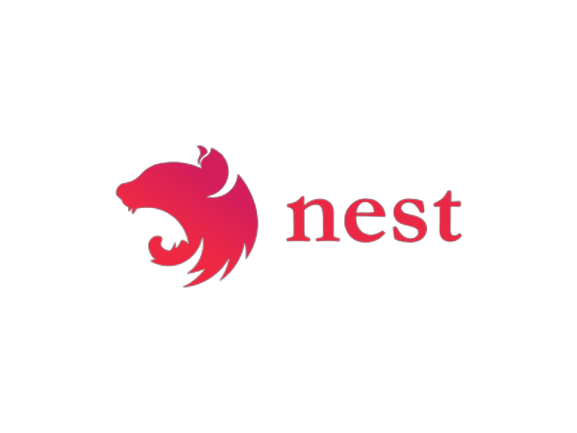

<p>
  <a href="" target="blank"></a>
  <a href="" target="blank"></a>
</p>

## Description

[Nest](https://github.com/nestjs/nest) + [Prisma](https://github.com/prisma/prisma) + [TypeScript](https://github.com/microsoft/TypeScript) starter repository.

### Production-ready REST API:
* Error Handling (Exception Filters)
* DB Seeds/Migrations
* Built-in AuthModule, using JWT. Route Guards
* Model Events Listener (onCreated, …)
* Deployable. CI/CD pipeline using Github Actions.
* Advanced ESLint/TSLint config. (e.g: auto-fix will remove unused imports)
* Shared services/constants/helpers
* Middlewares/Interceptors implementation example.
* You can read about Prisma command in About Prisma.txt

## Installations

```bash
$ npm install
```

## Running the app

```bash
# development
$ npm run start

# watch mode
$ npm run start:dev

# production mode
$ npm run start:prod

```

## Test

```bash
# unit tests
$ npm run test

# e2e tests
$ npm run test:e2e

# test coverage
$ npm run test:cov
```

## Prisma (ORM)
```bash
# IDE for your database
$ npx prisma studio 

# run migrations (apply schema changes)
$ npx prisma migrate dev

# run migrations on CI/CD
$ npx prisma migrate deploy

# apply db schema changes to the prisma client
$ npx prisma generate
```


## Auth
This implementation uses `httpOnly` (server-side) cookie-based authentication. [Read more](https://dev.to/guillerbr/authentication-cookies-http-http-only-jwt-reactjs-context-api-and-node-on-backend-industry-structure-3f8e)

That means that the `JWT Token` is never stored on the client. 
Usually it was stored in `localStorage` / `sesionStorage` / `cookies` (browser), but this is not secure. 

Storing the token on a server side cookie is more secure, but it requires a small adjustment on frontend HTTP requests in order to work.

Frontend adjustments
* If you're using `axios` then you need to set: `withCredentials: true`. [Read more](https://flaviocopes.com/axios-credentials/)
* If you're using `fetch` then you need to set: `credentials: 'include'`. [Read more](https://github.com/github/fetch#sending-cookies)


## Code Style
Sync your IDE with project eslintrc.js. 

Check `Run ESLint --fix on save`

## Stay in touch

- Author - [Igor Mardari](https://www.linkedin.com/in/igor-mardari-7code/) | [GarryOne](https://github.com/GarryOne)
- Website - [7code.ro](https://7code.ro/)
- Github - [@7codeRO](https://github.com/7codeRO/)

## License

  [MIT licensed](https://github.com/nestjs/nest/blob/master/LICENSE).
